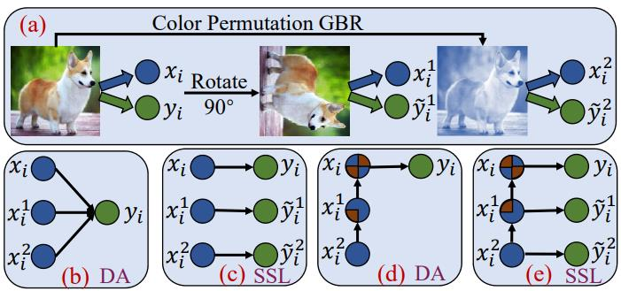

# [Tree Structure-Aware Few-Shot Image Classification via Hierarchical Aggregation](https://arxiv.org/pdf/2207.06989.pdf) 

This code implements the HTS algorithm.

If you find this repository useful in your research, please cite the following paper:
```
@inproceedings{zhang2022tree,
  title={Tree Structure-Aware Few-Shot Image Classification via Hierarchical Aggregation},
  author={Zhang, Min and Huang, Siteng and Li, Wenbin and Wang, Donglin},
  booktitle={Proceeding of the 17th European Conference on Computer Vision, ECCV},
  year={2022}
}
```




## Abstract

In this paper, we mainly focus on the problem of how to learn additional feature representations for few-shot image classification through pretext tasks (e.g., rotation or color permutation and so on). This additional knowledge generated by pretext tasks can further improve the performance of few-shot learning (FSL) as it differs from human-annotated supervision (i.e., class labels of FSL tasks). To solve this problem, we present a plug-in Hierarchical Tree Structure-aware (HTS) method, which not only learns the relationship of FSL and pretext tasks, but more importantly, can adaptively select and aggregate feature representations generated by pretext tasks to maximize the performance of FSL tasks. A hierarchical tree constructing component and a gated selection aggregating component are introduced to construct the tree structure and find richer transferable knowledge that can rapidly adapt to novel classes with a few labeled images. Extensive experiments show that our HTS can significantly enhance multiple few-shot methods to achieve new state-of-the-art performance on four benchmark datasets. 

## Benchmark Datasets

CUB-200-2011, MiniImagenet, TieredImagenet and CIFAR-FS are available from [Torchmeta](https://github.com/tristandeleu/pytorch-meta).

### Requirements
 - Python 3.6 or above
 - PyTorch 1.4 or above
 - Torchvision 0.5 or above

## More Details

Please refer to file README.md under each folder.

## License

This project is licensed under the MIT License. See LICENSE for more details.

## Acknowledgement

The experiments are based on the code:
- [torchmeta](https://github.com/tristandeleu/pytorch-meta) for few-shot image classification;

